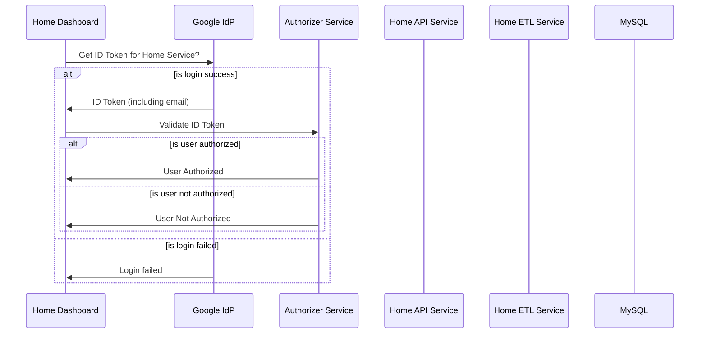

# Home Dashboard 

Home dashboard

## Available Scripts

### Start App Locally
```shell
npm start
```

### Launch Test Nunner
```shell
npm test
```

Launches the test runner in the interactive watch mode.\
See the section about [running tests](https://facebook.github.io/create-react-app/docs/running-tests) for more information.

### Build app for production
```shell
npm run build
```

Builds the app for production to the `build` folder.\
It correctly bundles React in production mode and optimizes the build for the best performance.

The build is minified and the filenames include the hashes.\
App is ready to be deployed!

See the section about [deployment](https://facebook.github.io/create-react-app/docs/deployment) for more information.

### Docker Build and Deploy
1. Build
```shell
docker build -t alokkusingh/home-dashboard:latest -t alokkusingh/home-dashboard:1.4.0 .
```
2. Push
```shell
docker push alokkusingh/home-dashboard:latest
```
```shell
docker push alokkusingh/home-dashboard:1.4.0
```
2. Deploy
```shell
docker run -d -p 8083:80 --rm --name home-dashboard alokkusingh/home-dashboard
```
## Open Distributed Tracing with Jaeger
1. Compiled and included ngx_http_opentracing_module
2. Enabled Jaeger header propagation
3. Enabled connection to Jaeger agent

## Sequence Diagram
